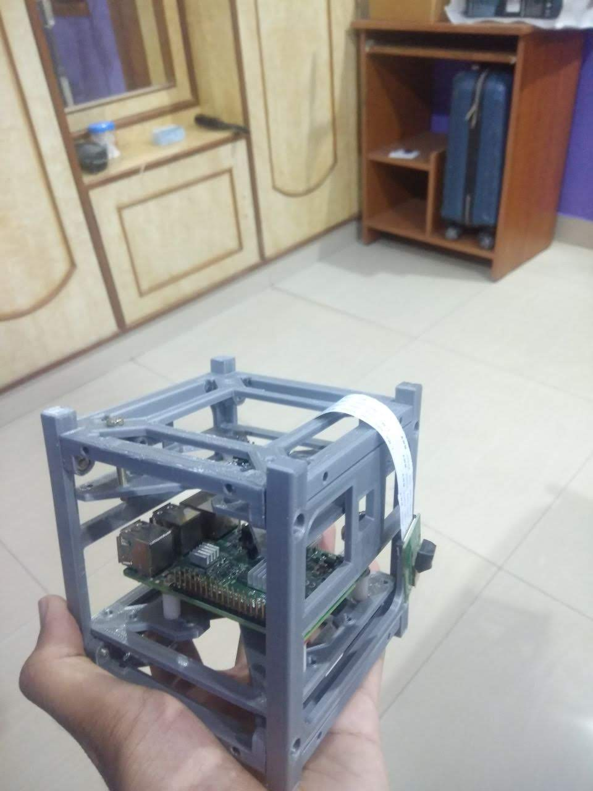

# Nebula
High altitude balloon project

###### Version 2 

.  

###### Version 1

## Hardware used
For the playload we have used 

* Raspberry pi
* Picam
* 3D Printer (for building an enclosure for the playload)
* BME280 temperature, pressure, and humidity sensor 
* MPU-6050 Accelerometer and Gyroscope module
* NEO-6m GPS module

#### Tracking 
for tracking the playload we are using Automatic Packet Reporting System ***(APRS)***. It's always a good idea to have an alternative tracking methods, as a contingency plan. Hence, after lot of research we decided to use LoRa (Long-Range) module.

### Pearks of using LoRa
* Cheap
* LoRa modules are transceiver i.e, can be used as both transmitter or receiver
* With a clear SOV (Sight Of View) has a range >100km. 

## Custom PCB Printed LoRa Breakout Board

